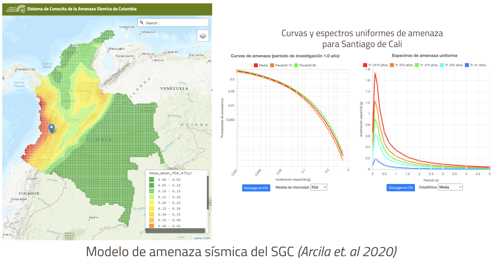

# 🌎 AMENAZA SÍSMICA

Los análisis de riesgo utilizan un modelo de amenaza sísmica de referencia (tanto en roca como en suelo).
Se realizó una revisión crítica de los modelos disponibles para la ciudad. A pesar de que los principios básicos para construir este tipo de modelos siguen siendo casi los mismos en los últimos 50 años (Cornell, 1968; McGuire, 2004), existe una amplia variedad de métodologías y aplicaciones para desarrollar sus componentes principales y estimar la amenaza. 

El reporte [D2.2.1 Descripción de las bases de datos recopiladas y los modelos de amenaza sísmica seleccionados](https://www.globalquakemodel.org/proj/treq-es?tab=publications))presenta en detalle la revisión de los modelos existentes, sus potencialidades y limitaciones.

El modelo propuesto por [Arcila et al. (2020)](https://libros.sgc.gov.co/index.php/editorial/catalog/book/38) fue seleccionado como modelo de referencia para el Municipio de Santiago de Cali. Adicionalmente, se incluyó la falla `Cauca-Cali-Patia` como sugerido por el estudio de microzonificación de la ciudad, siguiendo la metodología propuesta por el estudio de referencia. El modelo de referencia fue creado en el marco de una colaboración científica de tres años entre el Servicio Geológico Colombiano (SGC) y la Fundación GEM. Para construir el modelo, el SGC compiló un nuevo catálogo homogéneo de terremotos, utilizando información histórica revisada e información instrumental de distintas fuentes globales (como ISC, ISC-GEM, GCMT) y de fuentes regionales y locales. Adicionalmente, por medio de un enfoque multidisciplinario se mejoró el conocimiento actual sobre la tectónica activa y la deformación de la corteza en el territorio colombiano, brindando la posibilidad de desarrollar una caracterización compleja de las fuentes sísmicas. La siguiente figura presenta el mapa de amenaza sísmica para colombia, curvas y espectros uniformes de amenaza para Cali publicados por el [SGC](https://amenazasismica.sgc.gov.co/map/disaggregation/).

