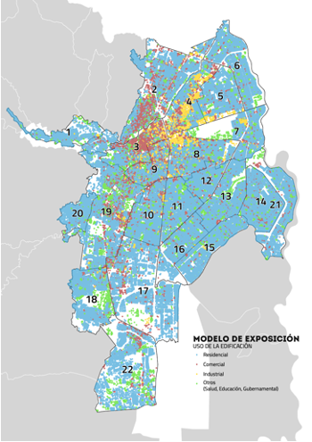
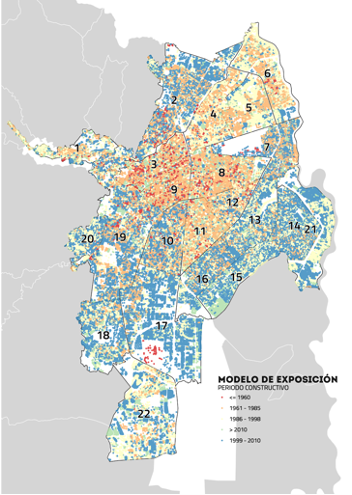
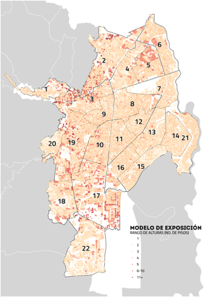
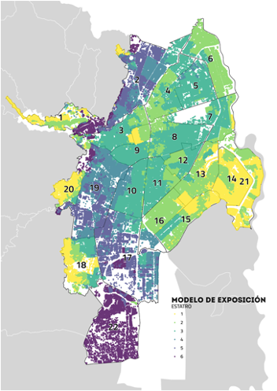

# 🏘️ MODELO DE EXPOSICIÓN

El modelo de exposición (también conocido como inventario de edificios y habitantes) para la ciudad de Santiago de Cali, Colombia, puede utilizarse junto con modelos de múltiples amenazas naturales y tecnológicas, y modelos de vulnerabilidad física y social, en el análisis de riesgo catastrófico.

Como paso inicial para el desarrollo de este modelo se complementó la geodatabase usada en estudios previos realizados por la Alcaldía de Cali (Etapa I y Etapa II), junto con información catastral actualizada (abril 30 de 2021). Con esta información se estimaron 349 mil edificios con más de 2 millones de habitantes (censo 2018). Posteriormente se asignó la tipología constructiva de las edificaciones, que permite asociar su vulnerabilidad física. Para la clasificación de las edificaciones se usó el número de pisos, estrato socioeconómico, tipo de uso y año de construcción (relacionado con la ductilidad). Se usó como referencia información de 25,641 encuestas a edificaciones de la ciudad para relacionar las variables consideradas con tipologías constructivas definidas según el material, sistema de resistencia a cargas laterales y ductilidad. 

Los detalles del modelo de exposición pueden encontrarse en:
- Reporte sobre la [Evaluación del Riesgo Sísmico en Cali](../TREQ_Deliverable_D262_Riesgo_Sismico_Cali.pdf)
- Reporte sobre las [tipologías constructivas en la ciudades de TREQ](https://www.globalquakemodel.org/proj/treq-es?tab=publications)

## Variables básicas para la clasificación de edificaciones
Se identificaron cuatro variables como punto de partida para la clasificación de las edificaciones: estrato socioeconómico, rango de alturas, uso de la edificación y período de construcción.

  

  

  

  

## Incertidumbres en el modelo
Para incorporar la incertidumbre epistémica asociada a la metodología propuesta, se generaron cuatro modelos de exposición a partir de esquemas de clasificación (criterio de expertos) que relacionan las variables de la base de datos con la tipología constructiva. Los modelos resultantes contienen entre 5,564 y 6,200 clases de edificaciones e indican que las tipologías dominantes son la mampostería confinada (51-63% de los edificios) y no reforzada (25-39%). 

## Uso del modelo de exposición
Para el uso del modelo, es decisión del analista cómo incorporar la incertidumbre asociada utilizando cada esquema generado como una opción viable, o utilizando directamente el inventario y asignando la vulnerabilidad aleatoriamente, según los pesos asignados en los esquemas de clasificación definidos por cada experto.

### Metadatos de los archivos del modelo de exposición
Los modelos de exposición contienen los siguientes metadatos:
| Código | Contenido |
| ----- | ------ |
| number | Número de edificios expuestos |
| structural | Valor económico de reemplazo expuesto (USD) |
| night | Número de ocupantes expuesto |

## Referencias
Detalles adicionales sobre la metodología pueden encontrarse en [Yepes-Estrada et. al 2022](https://www.researchgate.net/publication/361438249_MODELO_DE_EXPOSICION_PARA_LA_EVALUACION_DEL_RIESGO_CATASTROFICO_DE_SANTIAGO_DE_CALI_COLOMBIA_EXPOSURE_MODEL_FOR_CATASTROPHIC_RISK_ASSESSMENT_OF_SANTIAGO_DE_CALI_COLOMBIA)