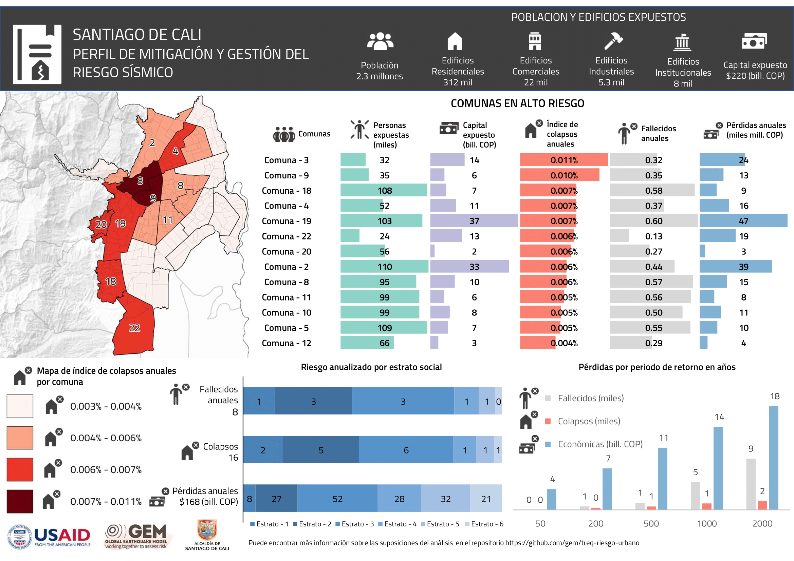

# SANTIAGO DE CALI, COLOMBIA 🇨🇴   Evaluación del riesgo sísmico a nivel urbano

## 📂 En este repositorio  

En este repositorio se puede encontrar los modelos desarrollados y resultados obtenidos para la evaluación del riesgo sísmico en la ciudad.

- **Amenaza:** Incluye información relativa al modelo de amenaza sísmica de referencia utilizado en los cálculos probabilísticos y para la selección de los escenarios sísmicos.
- **Condiciones_Sitio:** Archivos con los modelos de las condiciones de sitio en formato compatible con OpenQuake.
- **Exposicion:** Archivos con el modelo de exposición para la ciudad y los esquemas de clasificación que relacionan las tipologías constructivas y su vulnerabilidad (taxonomy_mapping) en formato compatible con OpenQuake..
- **Mapas:** Mapas e imágenes con los modelos o resultados para la ciudad.
- **OpenQuake:** Archivos de configuración para realizar los escenarios de riesgo o los cálculos probabilísticos.
- **Riesgo:** Resultados del análisis de riesgo usando OpenQuake y perfiles para la ciudad.
- **Rupturas_Sismicas:** Rupturas de los escenarios de riesgo sísmico seleccionados en formato compatible con OpenQuake.
- **SIG:** Capas georeferenciadas con los mapas de la ciudad con diferentes niveles administrativos.

## Vistazo de los resultados de riesgo sísmico

Para mayores detalles del modelo de riesgo sísmico y sus componentes dale un vistazo al video [Evaluación de Riesgo Sísmico para la Ciudad de Santiago de Cali: Resumen de Resultados](https://youtu.be/mVhQ0ZQchLY). Para mayor información sobre como utilizar este repositorio dale un vistazo a [este video](https://www.youtube.com/watch?v=foLn4Jc76RY).

### Perfiles de mitigación del riesgo sísmico (mediano y largo plazo)

  

### Perfiles de respuesta (escenarios sísmicos)

  

| Evento | Descripción                                                 | Magnitud (Mw) | Profundiad (km) |
|--------|-------------------------------------------------------------|---------------|-----------------|
| 1      | Evento Mw 8.8 en el pacífico - Plaza de Nazca               | 8.8           | 22              |
| 2      | Evento de Mw 6.5 al este - Saliente de Buga                 | 6.5           | 10              |
| 3      | Evento de Mw 6.5 al noreste de la ciudad - Saliente de Buga | 6.5           | 10              |
| 4      | Evento de Mw 6.5 - Cucuana dextral                          | 6.5           | 10              |
| 5      | Evento de Mw 6.5 - Dagua Calima                             | 6.5           | 10              |
| 6      | Terremoto de 1957                                           | 6.1           | 52              |
| 7      | Terremoto de 1925                                           | 6.3           | 15              |
| 8      | Terremoto de 1906                                           | 8.8           | 20              |
| 9      | Terremoto de 1991                                           | 7.2           | 21              |
| 10     | Terremoto de 1994                                           | 6.8           | 12              |
| 11     | Terremoto de 1995                                           | 6.4           | 73              |
| 12     | Terremoto de 1999                                           | 6.1           | 52              |
| 13     | Terremoto de 2004                                           | 7.2           | 15              |

## 📚 Publicaciones

Los siguientes entregables (deliverables) del proyecto TREQ son relevantes para el análisis de riesgo urbano en la ciudad, los cuales se encuentran disponibles en la página web [www.globalquakemodel.org/proj/treq-es](https://www.globalquakemodel.org/proj/treq-es?tab=publications):

| | Evaluación de la amenaza sísmica |
| :----: | ---- |
| D2.2.1 | Description of the compiled datasets and the selected seismic hazard models.  _[Descripción de las bases de datos recopiladas y los modelos de amenaza sísmica seleccionados]_|
| D2.2.3  | Seismic hazard results (rock and soil conditions).  _[Resultados de amenaza sísmica (condiciones en roca y en suelo)]_ |
| D2.2.4  | Seismic hazard analysis at the urban scale.  _[Análisis de la amenaza sísmica a escala urbana]_ |

| | Evaluación del riesgo sísmico |
| :----: | ---- |
| D2.3.1 | Technical report with description of building classes identified in each city.  _[Reporte sobre tipologías constructivas en las ciudades del Proyecto TREQ]_ |
| D2.3.2 | Geo-referenced exposure database of population and residential, industrial and commercial buildings, and where available, other occupancy classes. One database per city.  _[Base de datos de exposición georreferenciada de población y edificios residenciales, industriales y comerciales, y donde esté disponible, otras clases de ocupación. Una base de datos por ciudad]_ |
| D2.3.3 | Database of fragility and vulnerability functions for each building class present in the exposure model.  _[Base de datos de funciones de fragilidad y vulnerabilidad para cada clase de edificio presente en el modelo de exposición]_ |
| D2.3.4 | Maps and risk metrics generated for each city.  _[Mapas y métricas de riesgo para cada ciudad]_ |
| D2.3.5 | An executive summary report with findings and highlights of the exposure, vulnerability and risk models.  _[Resumen ejecutivo con hallazgos y aspectos destacados de los modelos de exposición, vulnerabilidad y riesgo]_ |

## 🌟 Colaboradores 

  

  

  

  

  

Agradecemos a las instituciones y colaboradores que participaron en el desarrollo de las actividades del proyecto TREQ en la ciudad. Esto incluye la facilitación de la información de entrada, desarrollo de los modelos y revisión de la información.

En particular, queremos agradecer a la Alcaldía de Santiago de Cali por su aporte, a través de las oficinas de Planeación Municipal y de la Secretaría de Gestión del Riesgo de Emergencias y Desastres.

| NOMBRE                         | INSTITUCIÓN                                                 |
|--------------------------------|-------------------------------------------------------------|
| Alejandro Calderón Carpio | Fundación GEM |
| Ana Beatriz Acevedo | Universidad EAFIT |
| Andrés Prieto | Oficinas de Planeación Municipal |
| Catalina Yepes Estrada | Fundación GEM |
| Fernando Javier Díaz | Dirección de Geoamenazas, Servicio Geológico Colombiano (SGC) |
| Julian Gomez Arbelaez| Secretaría de Gestión del Riesgo de Emergencias y Desastres |
| Juliana Arenas Guzman| Universidad EAFIT |
| Julio García Pelaez | Antiguo miembro de la Fundación GEM |
| Hector Jose Perez Barrera  | Dirección de Geoamenazas, Servicio Geológico Colombiano (SGC) |
| Lana Todorović | Fundación GEM |
| Marco Pagani | Fundación GEM |
| Miguel Genaro Mora | Dirección de Geoamenazas, Servicio Geológico Colombiano (SGC) |
| Monica Arcila Rivera | Dirección de Geoamenazas, Servicio Geológico Colombiano (SGC) |
| Natalia Gomez Mazuera | Ingeneira Civil, Cali |
| Robert Chase | United States Geological Survey (USGS) |
| Robin Gee | Antiguo miembro de la Fundación GEM |
| Richard Styron | Fundación GEM |
| Shreyasvi Chandrasekhar | Fundación GEM |
| Srahyrlandy Rocio Diaz Sanchez | Secretaría de Gestión del Riesgo de Emergencias y Desastres |

# Licencia
Shield: [![CC BY-SA 4.0][cc-by-sa-shield]][cc-by-sa]

Esta trabajo está bajo una
[Licencia Creative Commons Atribución-CompartirIgual 4.0 Internacional][cc-by-sa].

[![CC BY-SA 4.0][cc-by-sa-image]][cc-by-sa]

[cc-by-sa]: https://creativecommons.org/licenses/by-sa/4.0/deed.es
[cc-by-sa-image]: https://licensebuttons.net/l/by-sa/4.0/88x31.png
[cc-by-sa-shield]: https://img.shields.io/badge/License-CC%20BY--SA%204.0-lightgrey.svg
