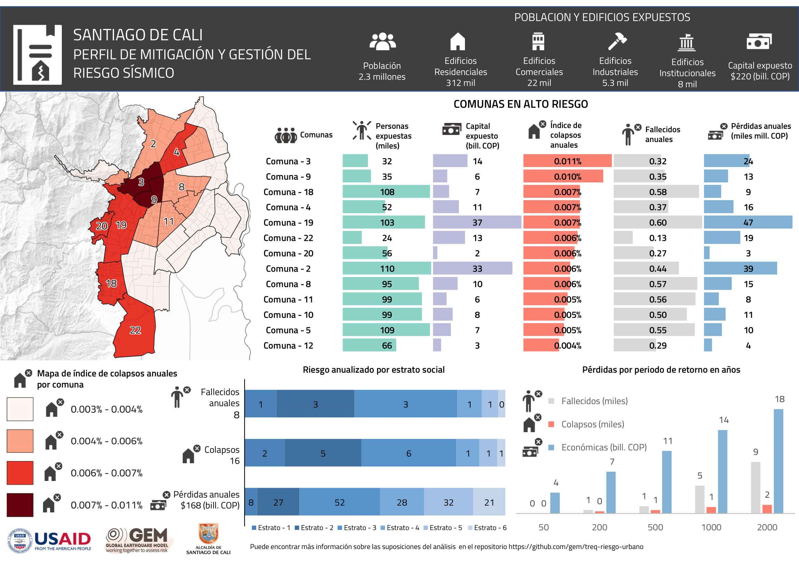

# RESULTADOS DE RIESGO

Los archivos de salida de los diferentes cálculos de OpenQuake y sus correspondientes mapas están disponibles en las siguientes carpetas:

Los perfiles de mitigación y de escenarios sísmicos generados para la ciudad están disponibles en [archivo perfiles de riesgo.pdf](./perfiles_de_riesgo.pdf).

### Perfil de mitigación del riesgo sísmico

  

## Cálculos probabilísticos (Event_Based)
| Carpeta | Descripción |
| ------- | ----------- |
| 46690 | Cali EB-damage (soil=AFs_TREQ, it=1, ses=500, branches=100); SGC2018+Cali-Patia fault; Exposure=beta0.3 (ABA)|

## Escenarios sísmicos (Scenarios)
| Carpeta | Descripción |
| ------- | ----------- |
|  47078  | Execute Cali scenario damage id:big_north_nazca_cali_subduction.npy |
|  47080  | Execute Cali scenario damage id:cali_e65_saliente_de_buga2_reverse.npy |
|  47082  | Execute Cali scenario damage id:cali_ne65_saliente_de_buga1_reverse.npy |
|  47084  | Execute Cali scenario damage id:cali_se65_cucuana_dextral.npy |
|  47086  | Execute Cali scenario damage id:cali_w65_dagua_calima_norm.npy |
|  47088  | Execute Cali scenario damage id:iscgem886586.npy |
|  47090  | Execute Cali scenario damage id:iscgem910531.npy |
|  47092  | Execute Cali scenario damage id:official19060131153610_30.npy |
|  47094  | Execute Cali scenario damage id:usp0004zbt.npy |
|  47100  | Execute Cali scenario damage id:usp0006dv8.npy |
|  47113  | Execute Cali scenario damage id:usp000d8gx.npy |
|  47117  | Execute Cali scenario damage id:usp0006skc.npy |
|  47119  | Execute Cali scenario damage id:usp00091q3.npy |