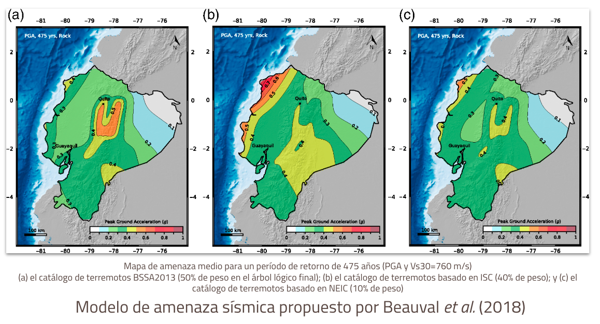

# 🌎 AMENAZA SÍSMICA

Los análisis de riesgo utilizan un modelo de amenaza sísmica de referencia (tanto en roca como en suelo).
Se realizó una revisión crítica de los modelos disponibles para la ciudad. A pesar de que los principios básicos para construir este tipo de modelos siguen siendo casi los mismos en los últimos 50 años (Cornell, 1968; McGuire, 2004), existe una amplia variedad de métodologías y aplicaciones para desarrollar sus componentes principales y estimar la amenaza. 

El reporte [D2.2.1 Descripción de las bases de datos recopiladas y los modelos de amenaza sísmica seleccionados](https://www.globalquakemodel.org/proj/treq-es?tab=publications))presenta en detalle la revisión de los modelos existentes, sus potencialidades y limitaciones.

El modelo propuesto por [Beauval et al. (2018)](https://pubs.geoscienceworld.org/ssa/bssa/article/108/3A/1443/530020/A-New-Seismic-Hazard-Model-for-EcuadorA-New) para Ecuador se utilizó como referencia. Este no es el modelo nacional oficial implementado en la regulación ecuatoriana. Para los análisis no se utilizó la versión original del modelo, sino una adaptación compartida por la autora principal por medio de comunicación directa.
La versión compartida contiene un solo archivo XML (faultmodelGeod50cat2.xml) correspondiente a una sola rama del modelo de origen (sin incertidumbre epistémica del modelo de origen). De acuerdo con la Figura 11 en [Beauval et al. (2018)](https://pubs.geoscienceworld.org/ssa/bssa/article/108/3A/1443/530020/A-New-Seismic-Hazard-Model-for-EcuadorA-New), este es el "Modelo de fallas", donde las fuentes de interfaz e intraplaca se caracterizan por el catálogo basado en ISC ("catálogo 2") y el modelo de fallas + sismicidad de fondo utiliza tasas de deslizamiento geodésico con un 50% de sismicidad. Esta rama fue elegida para incluir fuentes de fallas en las proximidades de Quito, aunque no es el ramal de mayor peso en el modelo original. Los otros archivos de entrada (es decir, gmmLT.xml y el trabajo.ini) fueron generados por GEM siguiendo a [Beauval et al. (2018)](https://pubs.geoscienceworld.org/ssa/bssa/article/108/3A/1443/530020/A-New-Seismic-Hazard-Model-for-EcuadorA-New).

