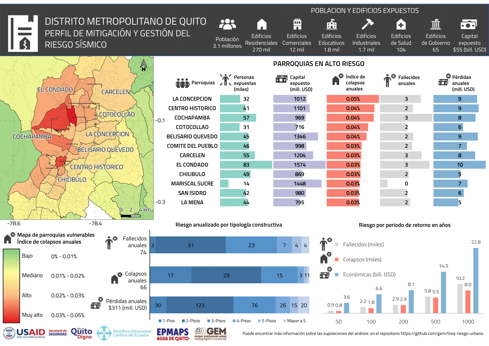
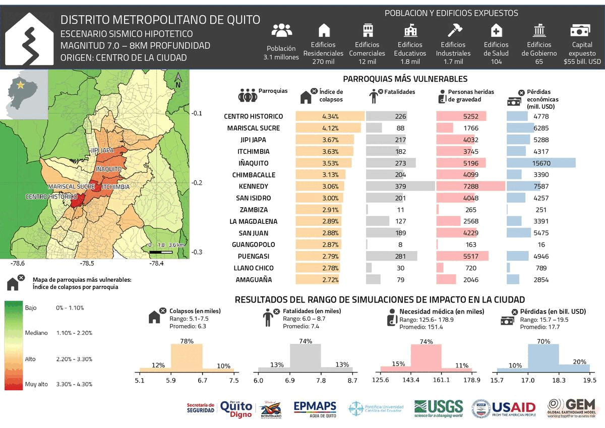
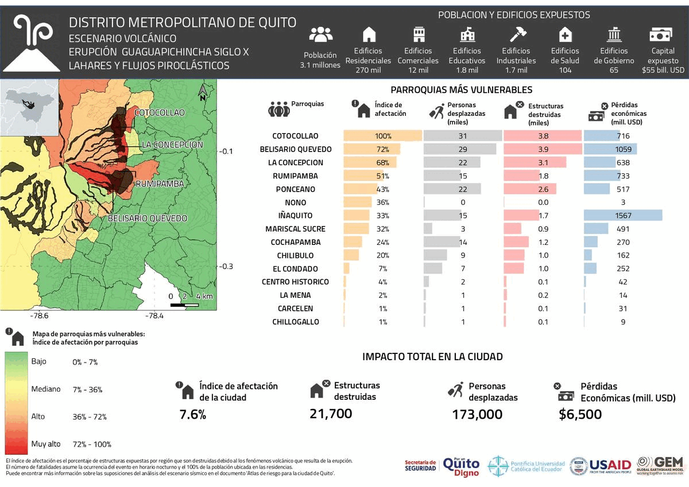

# RESULTADOS DE RIESGO

Los archivos de salida de los diferentes cálculos de OpenQuake y sus correspondientes mapas están disponibles en las siguientes carpetas:
* Event_Based
* Scenarios
* Volanic

El perfiles de mitigación, los de escenarios sísmicos y de escenarios volcánicos generados para la ciudad están disponibles en el [archivo perfiles de riesgo.pdf](./perfiles_de_riesgo.pdf).

Todos los resultados de riesgo que se presentan en este repositorio corresponden a cálculos usando las funciones de amplificación desarrolladas para la ciudad dentro de las actividades del proyecto TREQ. Sin embargo, en la Carpeta_ref 45298 se proporcionan los resultados utilizando valores aproximados de Vs30 como referencia.

## Cálculos probabilísticos (Event_Based)

| Carpeta_ref | Descripción                                                              |
|-------------|--------------------------------------------------------------------------|
|     45297   | Quito EB-damage (soil=AFs, it=1, ses=10000, branches=all), Exposure=br1  |
|     45298   | Quito EB-damage (soil=Vs30, it=1, ses=10000, branches=all), Exposure=br1 |

### Perfil de mitigación del riesgo sísmico

  

## Escenarios sísmicos (Scenarios)

| Evento | Carpeta_ref | Archivo                       | Descripción                                              | Magnitud (Mw) | Profundiad (km) |
|--------|-------------|-------------------------------|----------------------------------------------------------|---------------|-----------------|
|   1    |    47127    | quito_mfr.npy                 | Falla de Quito, Evento Mw6.5 en el centro de la ciudad   |     6.5       |      8          |
|   2    |    47129    | quito_n65.npy                 | Falla de Quito, Evento Mw6.5 en el norte de la ciudad    |     6.5       |      8          |
|   3    |    47131    | quito_qf70.npy                | Falla de Quito, Evento Mw7.0 en el centro de la ciudad   |     7         |      8          |
|   4    |    47133    | quito_s65.npy                 | Falla de Quito, Evento Mw6.5 al sur de la ciudad         |     6.5       |      8          |
|   5    |    47135    | quito_w65.npy                 | Falla de Quito, Evento Mw6.5 al oeste de la ciudad       |     6.5       |      8          |
|   6    |    47125    | official19060131153610_30.npy | Nazca, Terremoto de 1906 Subducción de la Placa de Nazca |     8.8       |      20         |
|   7    |    47137    | us20005j32.npy                | Manabí, Terremoto de Muisne de 2016                      |     7.8       |      20         |

### Perfiles de escenarios de riesgo sísmico

  

## Escenarios volcánicos (Volcanic)

| Carpeta_ref | Descripción                                      |
|-------------|--------------------------------------------------|
|     78      | Cotopaxí Eruption 1877 - Lahares                          |
|     80      | Guagua Pichincha Eruption siglo X - Lahares                       |
|     90      | Atacazo Ninahuilca Eruption de 5.440 a AP - (N4) - Ash fall         |
|     90      | Atacazo Ninahuilca Eruption de 5.440 a AP - (N4) - Piroclastic flow |
|     90      | Atacazo Ninahuilca Eruption de 5.440 a AP - (N4) - Lahares          |

### Perfiles de escenarios de riesgo volcánico

  

