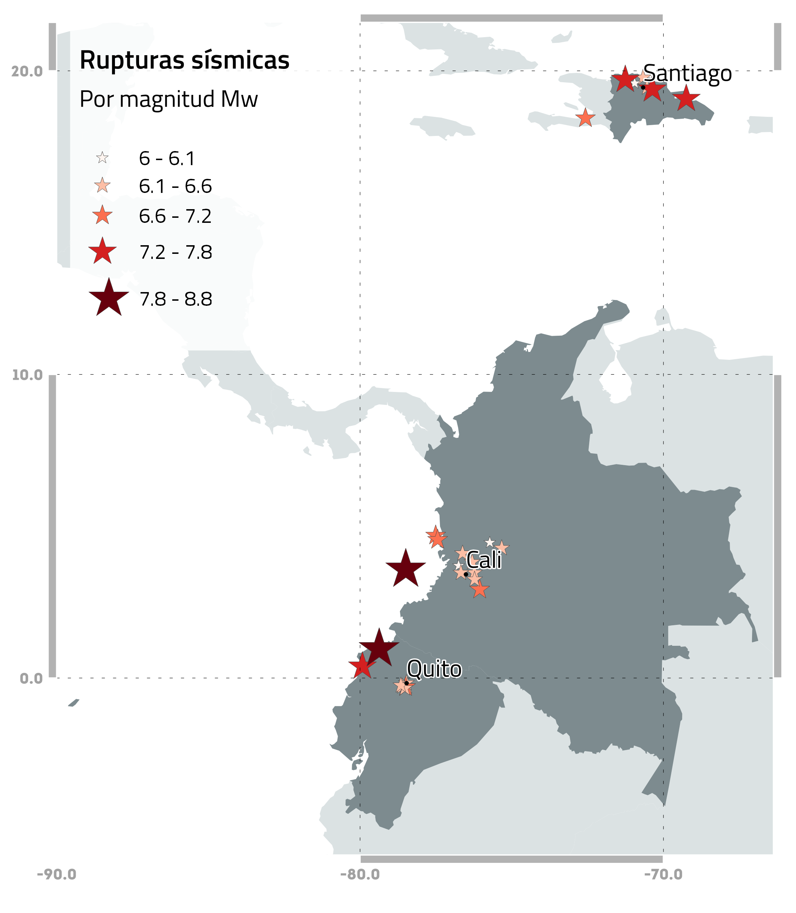

# RUPTURAS SÍSMICAS

Esta carpeta contiene las rupturas de los escenarios sísmicos en formato `*.npy` compatible con OpenQuake.
Este material fue desarrollado por el equipo del USGS.

La siguiente tabla incluye la descripción de los eventos modelados y su respectivo archivo de ruptura. La figura incluye la localización de los eventos:

| Evento | Carpeta_ref | Archivo                       | Descripción                                              | Magnitud (Mw) | Profundiad (km) |
|--------|-------------|-------------------------------|----------------------------------------------------------|---------------|-----------------|
|   1    |    47127    | quito_mfr.npy                 | Falla de Quito, Evento Mw6.5 en el centro de la ciudad   |     6.5       |      8          |
|   2    |    47129    | quito_n65.npy                 | Falla de Quito, Evento Mw6.5 en el norte de la ciudad    |     6.5       |      8          |
|   3    |    47131    | quito_qf70.npy                | Falla de Quito, Evento Mw7.0 en el centro de la ciudad   |     7         |      8          |
|   4    |    47133    | quito_s65.npy                 | Falla de Quito, Evento Mw6.5 al sur de la ciudad         |     6.5       |      8          |
|   5    |    47135    | quito_w65.npy                 | Falla de Quito, Evento Mw6.5 al oeste de la ciudad       |     6.5       |      8          |
|   6    |    47125    | official19060131153610_30.npy | Nazca, Terremoto de 1906 Subducción de la Placa de Nazca |     8.8       |      20         |
|   7    |    47137    | us20005j32.npy                | Manabí, Terremoto de Muisne de 2016                      |     7.8       |      20         |

  

