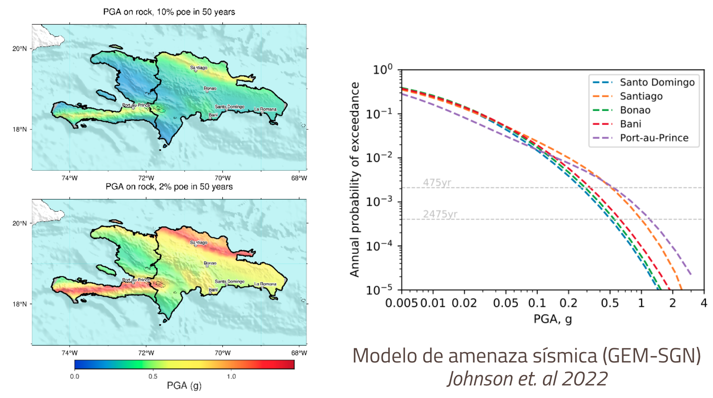

# 🌎 AMENAZA SÍSMICA

Los análisis de riesgo utilizan un modelo de amenaza sísmica de referencia (tanto en roca como en suelo).
Se realizó una revisión crítica de los modelos disponibles para la ciudad. A pesar de que los principios básicos para construir este tipo de modelos siguen siendo casi los mismos en los últimos 50 años (Cornell, 1968; McGuire, 2004), existe una amplia variedad de métodologías y aplicaciones para desarrollar sus componentes principales y estimar la amenaza. 

El reporte [D2.2.1 Descripción de las bases de datos recopiladas y los modelos de amenaza sísmica seleccionados](https://www.globalquakemodel.org/proj/treq-es?tab=publications))presenta en detalle la revisión de los modelos existentes, sus potencialidades y limitaciones.

Dado que a la fecha la República Dominicana no contaba con un modelo nacional de amenaza sísmica oficial, una de las actividades en el proyecto TREQ fue proponer un modelo en colaboración con expertos locales del Servicio Geológico Nacional (SGN) y la Universidad Autónoma de Santo Domingo (UASD). El SGN acompaño el desarrollo del modelo facilitando recopilación y revisión de los conjuntos de datos básicos necesarios y el Centro Nacional de Sismología de la UASD facilitó el catálogo más actualizado de la región (La Española).
La caracterización de las fuentes sísmicas, de los modelos de movimiento del terreno y selección de ecuaciones de atenuación (GMPEs) se describen en detalle en el reporte [D2.2.2 Modelo nacional de amenaza sísmica para la República Dominicana](https://cloud-storage.globalquakemodel.org/public/wix-new-website/pdf-collections-wix/publications/TREQ%20deliverables/publications/TREQ_Deliverable_D222_DOM_PSHA-v2.1-Spanish.pdf).

Visite el sitio dónde puede descargar el reporte y los archivos en formato OpenQuake del modelo: https://www.globalquakemodel.org/product/dominican-republic-hazard-model