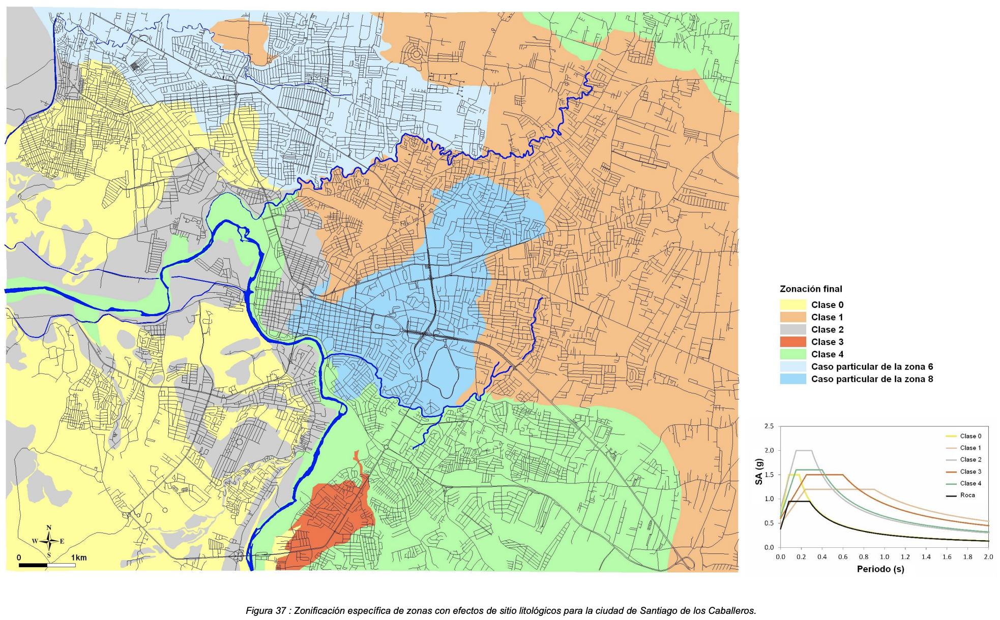
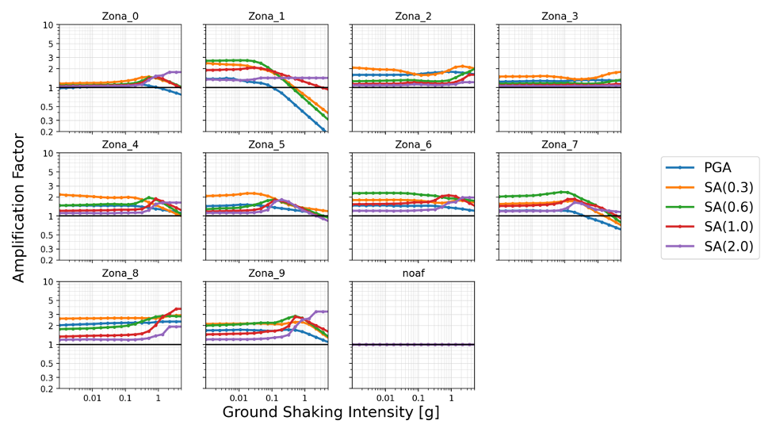

# CONDICIONES DE SITIO

Los archivos de esta carpeta incluyen diferentes condiciones de sitio para la ciudad, en formato compatible con OpenQuake.

- **site_model_uniform_grid_ampcodes.csv :** valores para usar con las funciones de amplificación (AFs)
- **site_model_uniform_grid_rock.csv :** valores para condiciones en roca
- **site_model_uniform_grid_vs30_USGS.csv :** valores para la Vs30 sugerida por el USGS (Servicio Geológico de los Estados Unidos)
- **soil_amplification_model_20210825_sigaf03.csv :** funciones de amplificación (AFs) para cada zona homogénea considerada en el estudio de la microzonificación sísmica de referencia

```Vs30: Velocidad de la onda de corte medida a 30km de profundidad```


## Microzonificación sísmica de referencia
[Roullé et al. 2011](https://www.sgn.gob.do/images/sismicidadT/Amenaza_Sism_Local_stgo.pdf): Microzonificación sísmica de Santiago de los Caballeros - República Dominicana Amenaza sísmica local. Informe final, BRGM/RC-59685-FR. Febrero 2011.

<p align="left">
  
</p>

## Funciones de amplificación
La siguiente figura presenta el modelo de respuesta del suelo, dónde se grafican las [funciones de amplificación](./soil_amplification_model_20210827_sigaf03.csv) (AF) medias en cada zona homogénea de la microzonificación para diferentes períodos. La zona “noaf” se usa para edificaciones fuera de las microzonas para lo que se asigna un AF=1 (sin amplificación) y en su lugar se usa un Vs30 inferido.

<p align="left">
  
</p>

El reporte [D2.2.4 Análisis de la amenaza sísmica a escala urbana](https://www.globalquakemodel.org/proj/treq-es?tab=publications))presenta en detalle los datos y metodología para el desarrollo de las funciones de amplificación.
