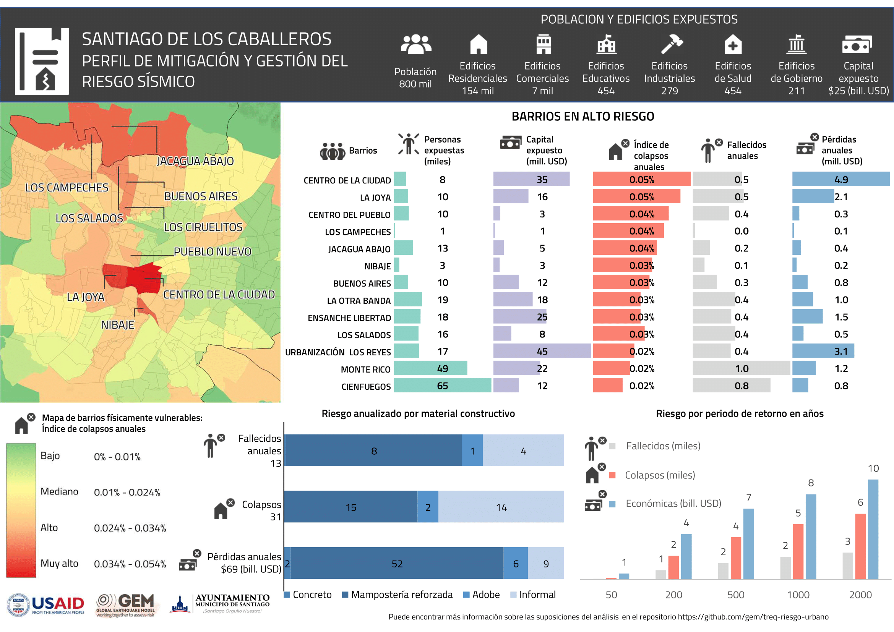
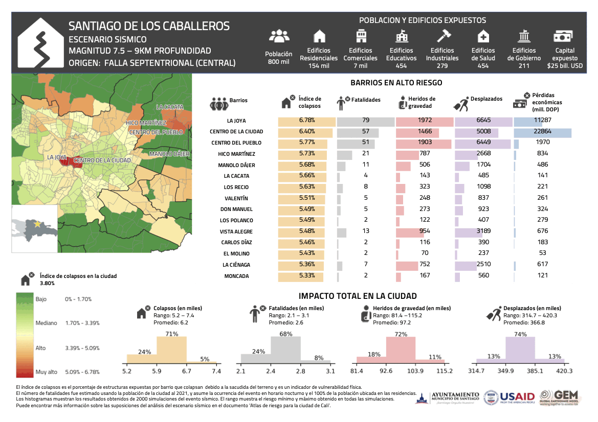

# SANTIAGO DE LOS CABALLEROS, REPÚBLICA DOMINICANA 🇩🇴   Evaluación del riesgo sísmico a nivel urbano

## 📂 En este repositorio  

En este repositorio se puede encontrar los modelos desarrollados y resultados obtenidos para la evaluación del riesgo sísmico en la ciudad.

- **Amenaza:** Incluye información relativa al modelo de amenaza sísmica de referencia utilizado en los cálculos probabilísticos y para la selección de los escenarios sísmicos.
- **Condiciones_Sitio:** Archivos con los modelos de las condiciones de sitio en formato compatible con OpenQuake.
- **Exposicion:** Archivos con el modelo de exposición para la ciudad y los esquemas de clasificación que relacionan las tipologías constructivas y su vulnerabilidad (taxonomy_mapping) en formato compatible con OpenQuake..
- **Mapas:** Mapas e imágenes con los modelos o resultados para la ciudad.
- **OpenQuake:** Archivos de configuración para realizar los escenarios de riesgo o los cálculos probabilísticos.
- **Riesgo:** Resultados del análisis de riesgo usando OpenQuake y perfiles para la ciudad.
- **Rupturas_Sismicas:** Rupturas de los escenarios de riesgo sísmico seleccionados en formato compatible con OpenQuake.
- **SIG:** Capas georeferenciadas con los mapas de la ciudad con diferentes niveles administrativos.

## Vistazo de los resultados de riesgo sísmico

El reporte [Evaluación del riesgo sísmico para Santiago de los Caballeros](./TREQ_Deliverable_D262_Riesgo_Sismico_Santiago.pdf) presenta los detalles de los modelos utilizados y resultados obtenidos.

### Perfiles de mitigación del riesgo sísmico (mediano y largo plazo)

  

### Perfiles de respuesta (escenarios sísmicos)

  

  | Evento | Descripción                   | Magnitud (Mw) | Profundiad (km) |
  |--------|-------------------------------|---------------|-----------------|
  | 1      | Falla Septentrional (oeste)   | 6             | 9               |
  | 2      | Falla Septentrional (central) | 6.5           | 9               |
  | 3      | Falla Septentrional (central) | 7.5           | 9               |
  | 4      | Falla Septentrional (oeste)   | 7.5           | 9               |
  | 5      | Terremoto de 1953             | 6.6           | 16.7            |
  | 6      | Terremoto de 1946             | 7.5           | 15              |
  | 7      | Terremoto de 2003             | 6.4           | 10              |
  | 8      | Terremoto de Haiti de 2010    | 7             | 13              |

## 📚 Publicaciones

Los siguientes entregables (deliverables) del proyecto TREQ son relevantes para el análisis de riesgo urbano en la ciudad, los cuales se encuentran disponibles en la página web [www.globalquakemodel.org/proj/treq-es](https://www.globalquakemodel.org/proj/treq-es?tab=publications):

| | Evaluación de la amenaza sísmica |
| :----: | ---- |
| D2.2.1 | Description of the compiled datasets and the selected seismic hazard models.  _[Descripción de las bases de datos recopiladas y los modelos de amenaza sísmica seleccionados]_|
| D2.2.2  | National earthquake hazard model for the Dominican Republic.  _[Modelo nacional de amenaza sísmica para la República Dominicana]_ |
| D2.2.3  | Seismic hazard results (rock and soil conditions).  _[Resultados de amenaza sísmica (condiciones en roca y en suelo)]_ |
| D2.2.4  | Seismic hazard analysis at the urban scale.  _[Análisis de la amenaza sísmica a escala urbana]_ |

| | Evaluación del riesgo sísmico |
| :----: | ---- |
| D2.3.1 | Technical report with description of building classes identified in each city.  _[Reporte sobre tipologías constructivas en las ciudades del Proyecto TREQ]_ |
| D2.3.2 | Geo-referenced exposure database of population and residential, industrial and commercial buildings, and where available, other occupancy classes. One database per city.  _[Base de datos de exposición georreferenciada de población y edificios residenciales, industriales y comerciales, y donde esté disponible, otras clases de ocupación. Una base de datos por ciudad]_ |
| D2.3.3 | Database of fragility and vulnerability functions for each building class present in the exposure model.  _[Base de datos de funciones de fragilidad y vulnerabilidad para cada clase de edificio presente en el modelo de exposición]_ |
| D2.3.4 | Maps and risk metrics generated for each city.  _[Mapas y métricas de riesgo para cada ciudad]_ |
| D2.3.5 | An executive summary report with findings and highlights of the exposure, vulnerability and risk models.  _[Resumen ejecutivo con hallazgos y aspectos destacados de los modelos de exposición, vulnerabilidad y riesgo]_ |

## 🌟 Colaboradores 

  

  

  

  

Agradecemos a las instituciones y colaboradores que participaron en el desarrollo de las actividades del proyecto TREQ en la ciudad. Esto incluye la facilitación de la información de entrada, desarrollo de los modelos y revisión de la información.

En particular, queremos agradecer al Ayuntamiento de Santiago de los Caballeros por su aporte, a través de la Oficina de Ordenamiento Territorial y al Servicio Geológico Nacional.

| NOMBRE                         | INSTITUCIÓN                     |
|--------------------------------|---------------------------------|
| Alejandro Calderón Carpio | Fundación GEM |
| Catalina Yepes Estrada | Fundación GEM |
| Claudia Deveaux Garrido | ONESVIE |
| Edwin García | Servicio Geológico Nacional (SGN) |
| Freddy Duran | Servicio Geológico Nacional (SGN) |
| Galvy Núñez | ONESVIE |
| Kerman Rodríguez | Oficina de Ordenamiento Territorial de Santiago |
| Julio García Pelaez | Antiguo miembro de la Fundación GEM |
| Leonardo Reyes Madera | ONESVIE |
| Marco Antonio Gomez | Oficina de Ordenamiento Territorial de Santiago |
| Marco Pagani | Fundación GEM |
| María Betania Roque de Medina | Antiguo miembro del Servicio Geológico Nacional (SGN) |
| Pedro Iván Marquez | ONESVIE |
| Ramon Delanoy | Universidad Autónoma de Santo Domingo (UASD) |
| Robin Gee | Antiguo miembro de la Fundación GEM |
| Richard Styron | Fundación GEM |
| Santiago Muñoz | Antiguo miembro del Servicio Geológico Nacional (SGN) |
| Shreyasvi Chandrasekhar | Fundación GEM |
| Thomas Chartier | Fundación GEM |
| Yesica Perez | Servicio Geológico Nacional (SGN) |

# Licencia
Shield: [![CC BY-SA 4.0][cc-by-sa-shield]][cc-by-sa]

Esta trabajo está bajo una
[Licencia Creative Commons Atribución-CompartirIgual 4.0 Internacional][cc-by-sa].

[![CC BY-SA 4.0][cc-by-sa-image]][cc-by-sa]

[cc-by-sa]: https://creativecommons.org/licenses/by-sa/4.0/deed.es
[cc-by-sa-image]: https://licensebuttons.net/l/by-sa/4.0/88x31.png
[cc-by-sa-shield]: https://img.shields.io/badge/License-CC%20BY--SA%204.0-lightgrey.svg