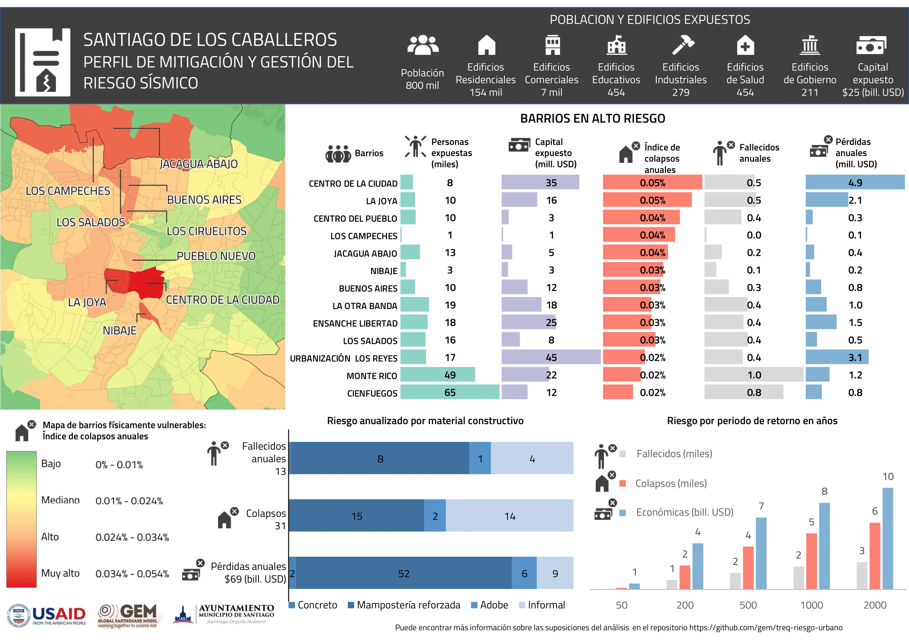

# RESULTADOS DE RIESGO

Los archivos de salida de los diferentes cálculos de OpenQuake y sus correspondientes mapas están disponibles en las siguientes carpetas:

Los perfiles de mitigación y de escenarios sísmicos generados para la ciudad están disponibles en [archivo perfiles de riesgo.pdf](./perfiles_de_riesgo.pdf).

### Perfil de mitigación del riesgo sísmico

  

## Cálculos probabilísticos (Event_Based)
| Carpeta | Descripción |
| ------- | ----------- |
|  47360  |  Santiago EB-damage (soil=AFs, it=1, ses=1000, branches=100); Exposure=br1|

## Escenarios sísmicos (Scenarios)
| Carpeta | Descripción |
| ------- | ----------- |
|  47363  | Execute Santiago scenario damage id:dr_60_septentrional_western.npy |
|  47365  | Execute Santiago scenario damage id:dr_65_septentrional_central.npy |
|  47367  | Execute Santiago scenario damage id:dr_75_septentrional_central.npy |
|  47369  | Execute Santiago scenario damage id:dr_75_septentrional_western.npy |
|  47371  | Execute Santiago scenario damage id:iscgem891713_DR1953.npy |
|  47373  | Execute Santiago scenario damage id:iscgem898498.npy |
|  47375  | Execute Santiago scenario damage id:usp000c89d_DR2003.npy |
|  47377  | Execute Santiago scenario damage id:usp000h60h.npy |