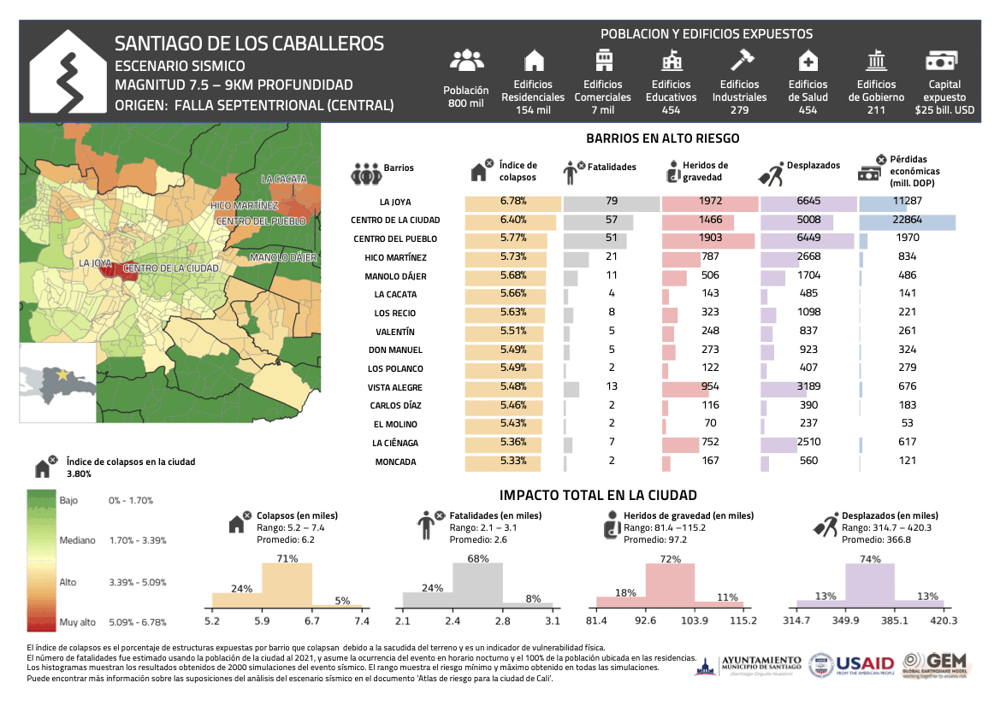

# RESULTADOS DE RIESGO

Los archivos de salida de los diferentes cálculos de OpenQuake y sus correspondientes mapas están disponibles en las siguientes carpetas:

Los perfiles de mitigación y de escenarios sísmicos generados para la ciudad están disponibles en el [archivo perfiles de riesgo.pdf](./perfiles_de_riesgo.pdf).

## Cálculos probabilísticos (Event_Based)

| Carpeta_ref | Descripción |
| ----------- | ----------- |
|    47360    |  Santiago EB-damage (soil=AFs, it=1, ses=1000, branches=100); Exposure=br1|

### Perfil de mitigación del riesgo sísmico

  

## Escenarios sísmicos (Scenarios)

| Evento | Carpeta_ref | Archivo                         | Descripción                   | Magnitud (Mw) | Profundiad (km) |
|--------|-------------|---------------------------------|-------------------------------|---------------|-----------------|
|   1    |    47363    | dr_60_septentrional_western.npy | Falla Septentrional (oeste)   |      6        |       9         |
|   2    |    47365    | dr_65_septentrional_central.npy | Falla Septentrional (central) |      6.5      |       9         |
|   3    |    47367    | dr_75_septentrional_central.npy | Falla Septentrional (central) |      7.5      |       9         |
|   4    |    47369    | dr_75_septentrional_western.npy | Falla Septentrional (oeste)   |      7.5      |       9         |
|   5    |    47371    | iscgem891713_DR1953.npy         | Terremoto de 1953             |      6.6      |       16.7      |
|   6    |    47373    | iscgem898498.npy                | Terremoto de 1946             |      7.5      |       15        |
|   7    |    47375    | usp000c89d_DR2003.npy           | Terremoto de 2003             |      6.4      |       10        |
|   8    |    47377    | usp000h60h.npy                  | Terremoto de Haiti de 2010    |      7        |       13        |

### Perfiles de escenarios de riesgo sísmico

  

