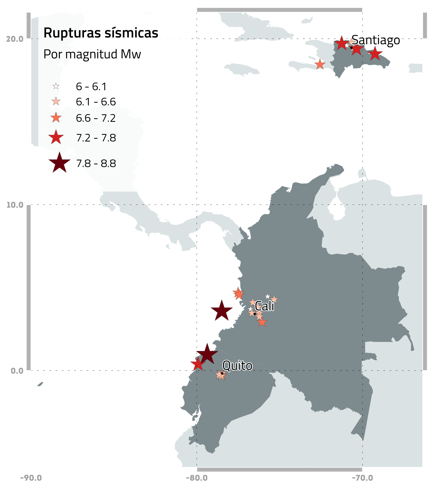

# RUPTURAS SÍSMICAS

Esta carpeta contiene las rupturas de los escenarios sísmicos en formato `*.npy` compatible con OpenQuake.
Este material fue desarrollado por el equipo del USGS.

La siguiente tabla incluye la descripción de los eventos modelados y su respectivo archivo de ruptura. La figura incluye la localización de los eventos:

| Evento | Carpeta_ref | Archivo                         | Descripción                   | Magnitud (Mw) | Profundiad (km) |
|--------|-------------|---------------------------------|-------------------------------|---------------|-----------------|
|   1    |    47363    | dr_60_septentrional_western.npy | Falla Septentrional (oeste)   |      6        |       9         |
|   2    |    47365    | dr_65_septentrional_central.npy | Falla Septentrional (central) |      6.5      |       9         |
|   3    |    47367    | dr_75_septentrional_central.npy | Falla Septentrional (central) |      7.5      |       9         |
|   4    |    47369    | dr_75_septentrional_western.npy | Falla Septentrional (oeste)   |      7.5      |       9         |
|   5    |    47371    | iscgem891713_DR1953.npy         | Terremoto de 1953             |      6.6      |       16.7      |
|   6    |    47373    | iscgem898498.npy                | Terremoto de 1946             |      7.5      |       15        |
|   7    |    47375    | usp000c89d_DR2003.npy           | Terremoto de 2003             |      6.4      |       10        |
|   8    |    47377    | usp000h60h.npy                  | Terremoto de Haiti de 2010    |      7        |       13        |

  

